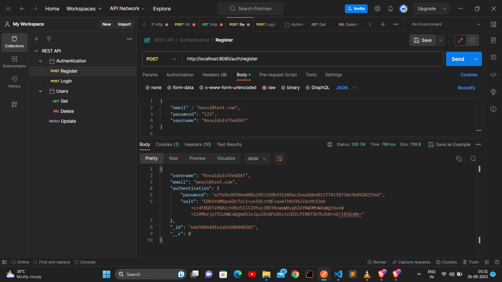
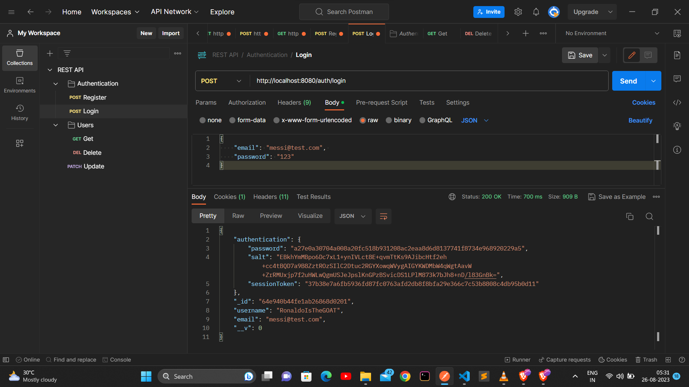
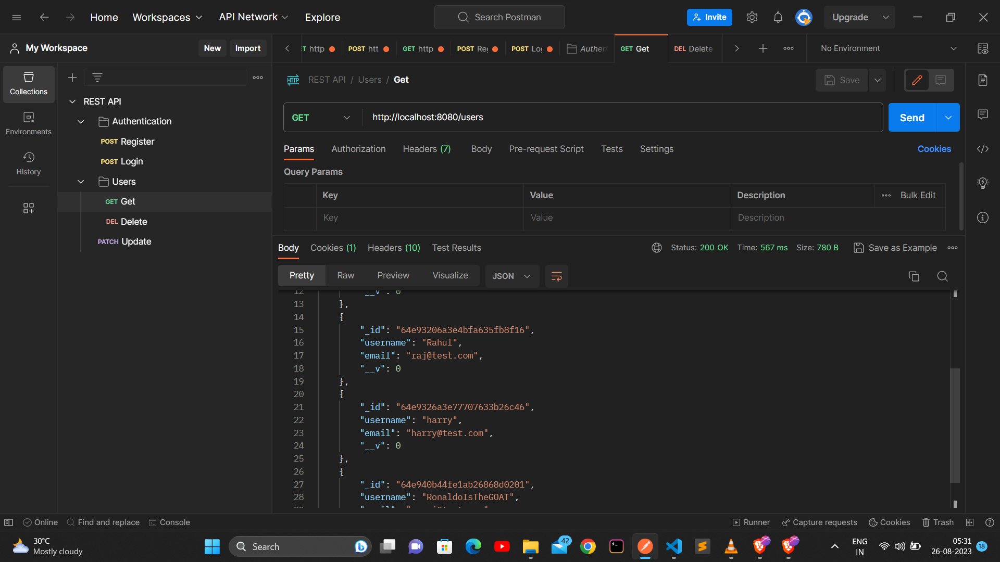
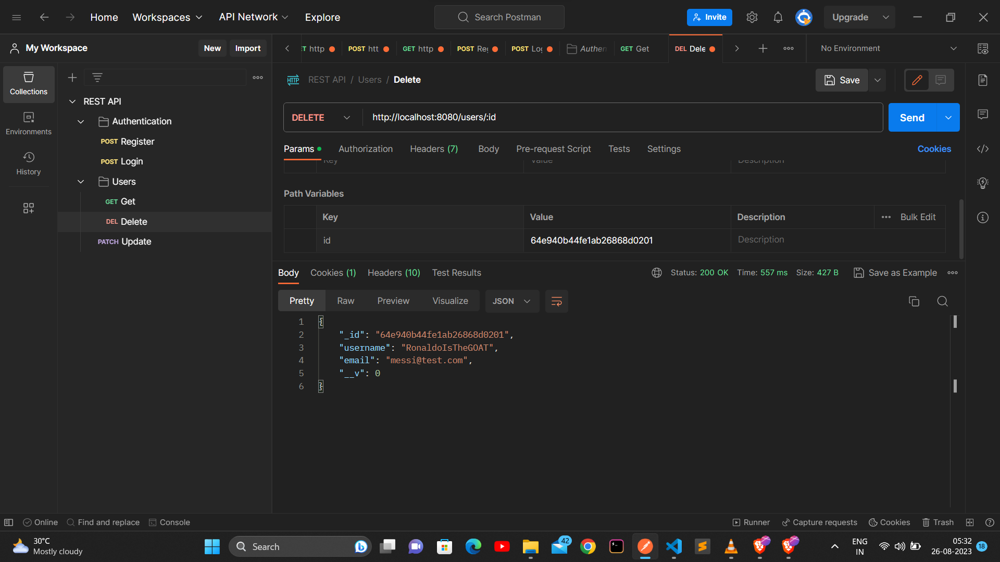
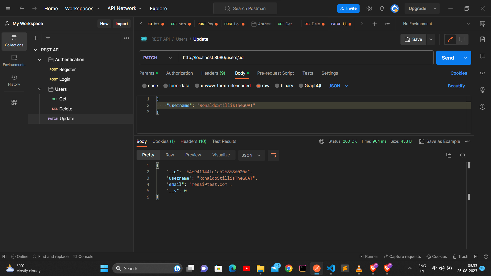

# A REST API With Node, Express, TypeScript & MongoDB


This is a repository for a REST API tutorial using Node, Express, Typescript & MongoDB.


Features:

- MongoDB & Mongoose connect, Database Creation
- Controllers Creation
- Middlewares Creation
- Cookie Based Authentication
- Create, Read, Update Users 
- Typescript, Nodemon 

### Cloning the repository

```shell
git clone https://github.com/hahahamid/typescript-node-mongoDB-REST-API.git
```

### Install packages

```shell
npm i
```

### Setup MongoDB URL

In `src/index.ts`:

add your own MONGODB URl  

```js
const MONGO_URL = ''; // MONGOURL
```

### Start the app

```shell
npm start
```

## Available commands

Running commands with npm `npm run [command]`

| command         | description                              |
| :-------------- | :--------------------------------------- |
| `start`         | Starts a development instance of the app |


## Screenshots


`Register` 





`Login` 





`Get All Users` 





`Delete User` 





`Update User` 





